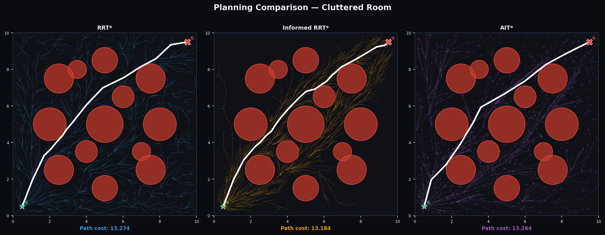
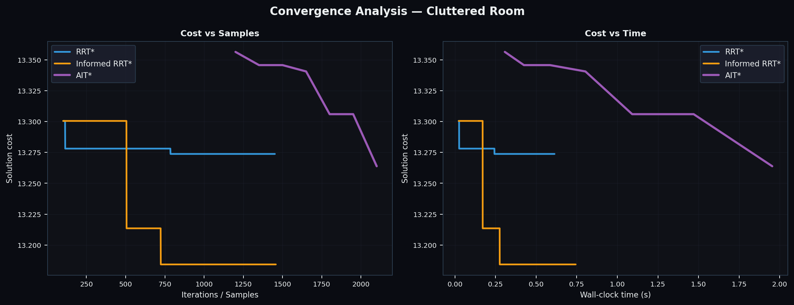
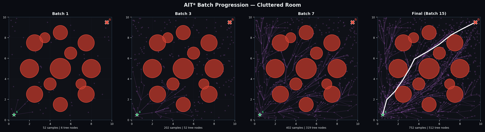
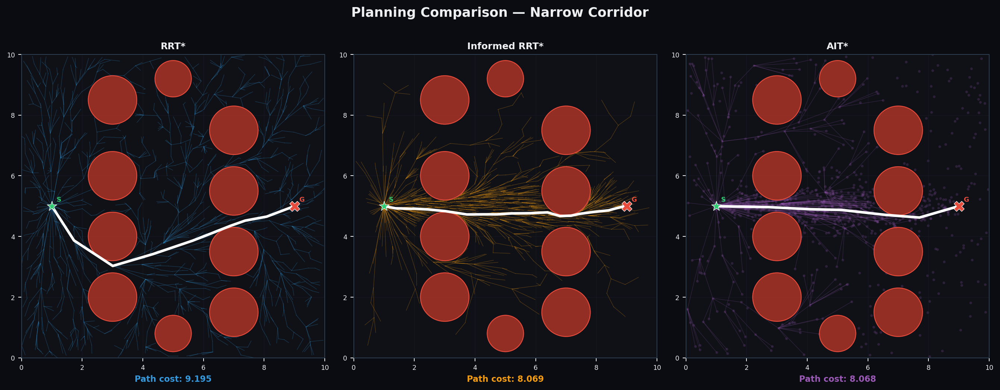
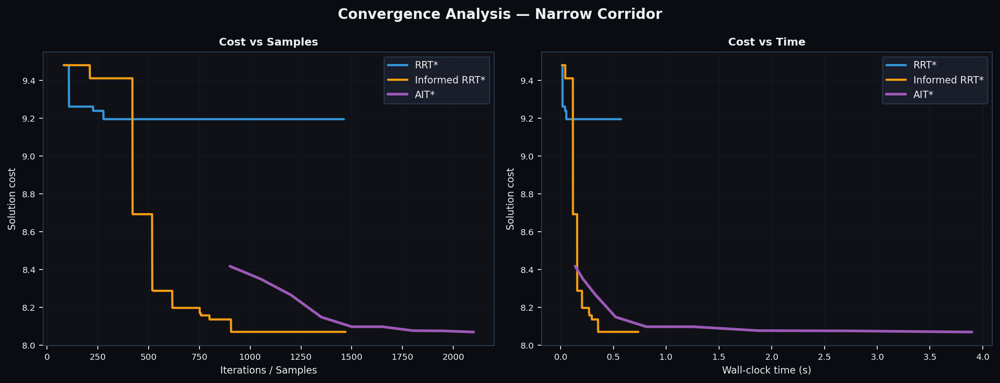
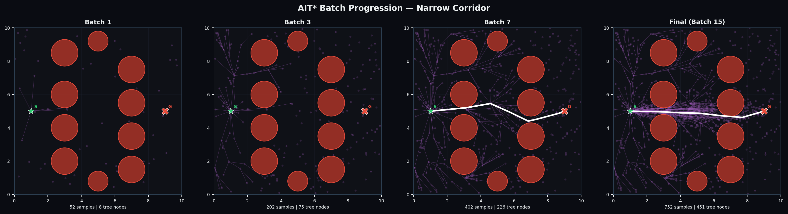

# ENPM661 Project 5 - AIT* Path Planner with Gazebo Simulation

## Team Members

| Name | Directory ID | UID |
|---|---|---|
| Syed Yashal Ahmed | sahmed43 | 122288393 |
| Sidharth Mathur | sidmat03 | 122277687 |
| Jigar Shah | jrshah3 | 121355690 |

---

## Description

Implements and benchmarks three asymptotically optimal sampling-based path planners — **RRT\***, **Informed RRT\***, and **AIT\*** (Adaptively Informed Trees) — on two 2D environments with circular obstacles. AIT\* is the primary algorithm, using batch sampling, a reverse Dijkstra adaptive heuristic, and lazy collision checking to converge to the optimal path faster than its predecessors. The final planned path is executed on a **TurtleBot3 Burger** robot in a **Gazebo** 3D simulation using ROS 2 Humble.

---

## Algorithms

| Algorithm | Key Idea | Reference |
|---|---|---|
| RRT\* | Random tree with rewiring for optimality | Karaman & Frazzoli, IJRR 2011 |
| Informed RRT\* | Restricts sampling to ellipsoidal informed set | Gammell et al., IROS 2014 |
| AIT\* | Batch sampling + reverse Dijkstra adaptive heuristic + lazy collision checking | Strub & Gammell, ICRA 2020 |

---

## Environments

Both environments use a **10 × 10 m** bounded workspace with circular obstacles.

| Environment | Obstacles | Start | Goal |
|---|---|---|---|
| Cluttered Room | 13 circles, radius 0.5–1.0 m | (0.5, 0.5) | (9.5, 9.5) |
| Narrow Corridor | 10 circles forming two columns | (1.0, 5.0) | (9.0, 5.0) |

---

## Dependencies

```
numpy
matplotlib
```

**For Gazebo simulation:**
```
ROS 2 Humble
ros-humble-gazebo-ros-pkgs
ros-humble-turtlebot3
ros-humble-turtlebot3-gazebo
```

### Install Python dependencies
```bash
pip install numpy matplotlib
```

### Install ROS 2 + Gazebo dependencies
```bash
sudo apt install ros-humble-desktop \
                 ros-humble-gazebo-ros-pkgs \
                 ros-humble-turtlebot3 \
                 ros-humble-turtlebot3-gazebo -y
```

---

## How to Run

### 2D Benchmark (Python only)

```bash
git clone https://github.com/sid-mat/AiT_star.git
cd AiT_star
python3 main.py
```

Outputs saved to `results/`:
- `comparison_cluttered_room.png`
- `comparison_narrow_corridor.png`
- `convergence_cluttered_room.png`
- `convergence_narrow_corridor.png`
- `ait_progression_cluttered_room.png`
- `ait_progression_narrow_corridor.png`

---

### Gazebo Simulation (ROS 2)

```bash
# Step 1 — Build the ROS 2 package
cd AiT_star/ros2_ws
source /opt/ros/humble/setup.bash
colcon build --packages-select ait_star_sim --symlink-install
source install/setup.bash

# Step 2 — Terminal 1: Launch Gazebo world
export TURTLEBOT3_MODEL=burger
export GAZEBO_MODEL_PATH=$GAZEBO_MODEL_PATH:/opt/ros/humble/share/turtlebot3_gazebo/models
gazebo ros2_ws/src/ait_star_sim/worlds/ait_world.world

# Step 3 — Terminal 2: Run AIT* planner node
ros2 run ait_star_sim ait_star_node

# Step 4 — Terminal 3: Run path follower (after "Path found!" in Terminal 2)
ros2 run ait_star_sim path_follower
```

---

## Algorithm Details

| Parameter | RRT\* | Informed RRT\* | AIT\* |
|---|---|---|---|
| Iterations / Batches | 1500 | 1500 | 15 batches |
| Batch / Step size | 0.5 m | 0.5 m | 50 samples/batch |
| Rewiring radius | `5·(log n/n)^0.5` | `5·(log n/n)^0.5` | `8·(log n/n)^0.5` |
| Goal bias | 5% | 5% | N/A |
| Sampling region | Full space | Informed ellipse | Informed ellipse |
| Collision checking | Eager | Eager | Lazy |
| Heuristic | Euclidean | Euclidean | Reverse Dijkstra |

---

## Gazebo Simulation Details

| Parameter | Value |
|---|---|
| Robot | TurtleBot3 Burger |
| Controller | Pure Pursuit |
| Lookahead distance | 0.5 m |
| Max linear velocity | 0.18 m/s |
| Max angular velocity | 1.2 rad/s |
| Obstacle inflation | 0.20 m (robot radius + safety margin) |
| Start pose | (0.5, 0.5) |
| Goal pose | (9.5, 9.5) |

---

## Results

### Cluttered Room




### Narrow Corridor




---

## File Structure

```
AiT_star/
├── planners/
│   ├── __init__.py
│   ├── ait_star.py               ← AIT* implementation
│   ├── informed_rrt_star.py      ← Informed RRT* implementation
│   └── rrt_star.py               ← RRT* implementation
├── utils/
│   ├── __init__.py
│   └── environment.py            ← 2D environment + collision checking
├── results/                      ← Generated benchmark plots
├── ros2_ws/
│   └── src/ait_star_sim/
│       ├── ait_star_sim/
│       │   ├── ait_star_node.py  ← ROS2 planner node
│       │   └── path_follower.py  ← Pure Pursuit controller
│       ├── worlds/
│       │   └── ait_world.world   ← Gazebo environment
│       ├── launch/
│       │   └── simulate.launch.py
│       ├── package.xml
│       └── setup.py
├── main.py                       ← Benchmark runner
└── README.md
```
